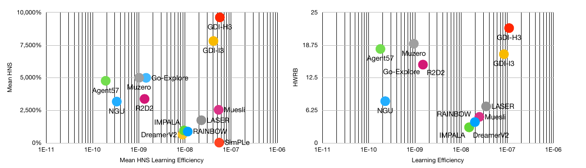

## Rethinking what makes Supervised Learning different from Reinforced Learning

Train neural net for entropy minimization via learned self supervised sampler.

Reduce entropy of dataset to improve generalization and accelerate learning convergence.

## Is interpolation all you need?
Yes. Interpolating between given concepts is enough to generalize between unseen tasks.

## GANs as source of robustness
Generative adversarial network are good only for approximating nash equilibrial but not for robust representation.

## What do?
Transform GAN to search engine to sample concepts from database. This is when operating in self supervised session (data is not labeled). When data is known use simple MLP to convert entropy in probability of sampling given class.

### TODO:
- Write demo example showing this method in action

## Paper showing similar idea
### GDI: Rethinking What Makes Reinforcement Learning Different From Supervised Learning

- Paper URL: https://arxiv.org/abs/2106.06232

Deep Q Network (DQN) firstly kicked the door of deep reinforcement learning
(DRL) via combining deep learning (DL) with reinforcement learning (RL), which
has noticed that the distribution of the acquired data would change during the
training process. DQN found this property might cause instability for training,
so it proposed effective methods to handle the downside of the property. Instead
of focusing on the unfavorable aspects, we find it critical for RL to ease the gap
between the estimated data distribution and the ground truth data distribution
while supervised learning (SL) fails to do so. From this new perspective, we
extend the basic paradigm of RL called the Generalized Policy Iteration (GPI)
into a more generalized version, which is called the Generalized Data Distribution
Iteration (GDI). We see massive RL algorithms and techniques can be unified
into the GDI paradigm, which can be considered as one of the special cases of
GDI. We provide theoretical proof of why GDI is better than GPI and how it
works. Several practical algorithms based on GDI have been proposed to verify
its effectiveness and extensiveness. Empirical experiments prove our state-of-
the-art (SOTA) performance on Arcade Learning Environment (ALE), wherein
our algorithm has achieved 9620.98% mean human normalized score (HNS),
1146.39% median HNS and 22 human world record breakthroughs (HWRB) using
only 200M training frames. Our work aims to lead the RL research to step into the
journey of conquering the human world records and seek real superhuman agents
on both performance and efficiency.
